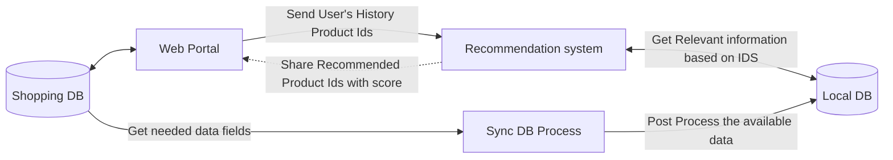

# Recommendation Engine

As name says, it is process data for **Hybrid Recommendation**. We have used multiple things like rating, review, popularity and similarity for better recommendation.

# Minimum required data  
product_info table with :  
'prodId','name','description'  
  
rating_review_info table with:  
'userId','prodId','product review','rating'  
  
user_history_info table with:  
'userId','prodId'  

# Project Set Up and Installation

 1. Clone the repository from this URL:  [http://192.168.30.240/poojan.shah/recommended-engine]  
 2. Create Virtual Environment in working directory.   
    `cd recommended-engine`  
     `python3 -m venv venv`  
 3. Activate Virtual Environment   
	  ` source venv/bin/activate`  
 4. Set `re.config`  file for **Data Connector**  
	 dtype: main input data source type (fake, csv, mysql, sqlite)  
	 **if dtype : csv**  
	prod_info_path: path of prod_info file  
	rat_info_path: path of rat_info file  
	uhis_info_path: path of uhis_info file  
	**if dtype = mysql**  
	user: user  
	password: password  
	host: host  
	**if dtype = mysql or sqlite**  
	database: name of your database  
	**table names**  
	prod_info: tablename (who have minimum product id, name and description columns)  
	rat_info: tablename (who have minimum user id, product id, rating and review columns)  
	uhis_info: tablename (who have minimum user id and product id columns)  
	**column names**  
	prodId: column name of products' id of your data  
	name: column name of products' name of your data  
	description: column name of products' description of your data  
	userId: column name of users' id of your data  
	rating:  column name of product's rating of your data  
	product_review: column name of product's review of your data  
	**others**  
	only_qualified: False (only_qualified product will use based on the minimum rating count required to be listed in the data.)  
	sdb: database name (for saving processed data and use for API)  
	**Caution:** every variable in each line with appropriate manner (example: variable:<single_space>variable_name )  
 5. Just execute main.py (for recursive process set worker for this)  
	 `python3 main.py`  
 6. All is ok, then you are good to Go for APIs!!!  

## For APIs

visit this URL: [documentation for APIs](https://www.postman.com/altimetry-physicist-26769757/workspace/recommendation-apis/documentation/16943432-4a2061ac-abac-4bd3-8cb1-fe9e9777b2ad)

## Logic behind the beast
**Fake data creation**  
Created fake data using Faker library

**Popular products**  
find visitor count per product and normalise

**Weighted Average**  
rating average and find score based on given formula  
Formula: (v/(v+m) * R) + (m/(m+v) * C)

----------

v is the number of ratings  
m is the minimum rating count required to be listed in the data  
R is the average rating of the product  
C is the mean vote across the whole data.

**Sentiment of text review**  
used pre-train model of twitter of hugging face  
sentiment and group by fresult per product  
[https://huggingface.co/cardiffnlp/twitter-roberta-base-sentiment/tree/main](https://huggingface.co/cardiffnlp/twitter-roberta-base-sentiment/tree/main)

**Content based filtering**  
Word2vec vectorization and nearest neighbour used for finding similer product

**Sorting best product for user**  
similar product sort based on weights 
1] sort based on user visited count * neighbour distance(20%)  
2] popular product (10%)  
3] sort based on rating (30%)  
4] sort based on text positive review (40%)

## Flow diagrams

